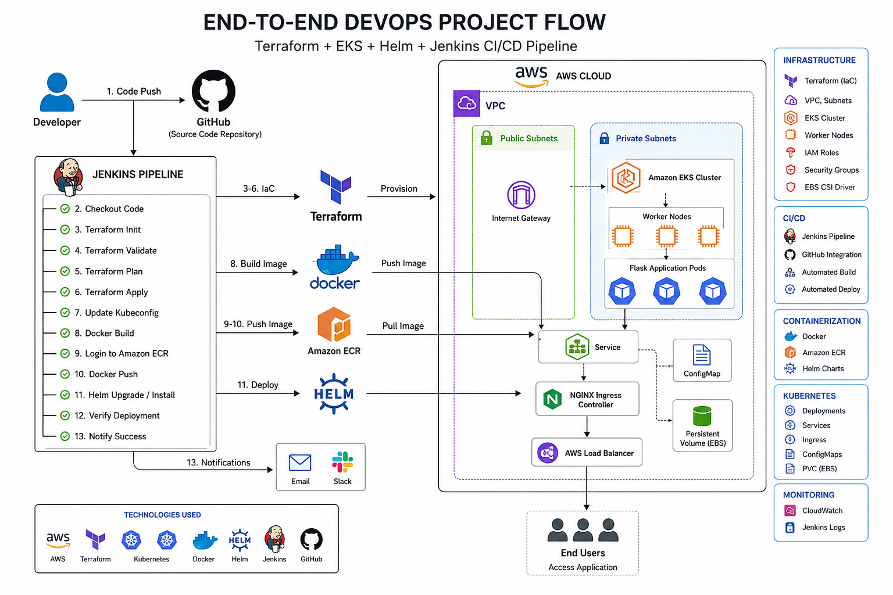

# DevOps-Assignment

# 🚀 DevOps Assignment – End-to-End CI/CD Deployment on AWS EKS



---

## 📌 Project Overview

This project demonstrates a complete DevOps implementation using Terraform, Docker, Amazon EKS, Helm, Jenkins and AWS ECR.

The application is a Flask web application containerized with Docker, pushed to Amazon ECR, deployed to Amazon EKS using Helm, and exposed through NGINX Ingress.

---

# 🏗 Architecture


---

# 🚀 Technology Stack

| Technology | Purpose |
|------------|----------|
| Python Flask | Web Application |
| Docker | Containerization |
| AWS ECR | Container Registry |
| Terraform | Infrastructure as Code |
| Amazon EKS | Kubernetes Cluster |
| Helm | Kubernetes Package Manager |
| NGINX Ingress | Load Balancer |
| Jenkins | CI/CD Pipeline |
| IAM | Security |
| VPC | Networking |

---

# 📁 Project Structure

```
DevOps-Assignment/
│
├── app/
│   ├── app.py
│   ├── Dockerfile
│   └── requirements.txt
│
├── terraform/
│   ├── provider.tf
│   ├── vpc.tf
│   ├── subnet.tf
│   ├── route.tf
│   ├── igw.tf
│   ├── nat.tf
│   ├── iam.tf
│   ├── eks.tf
│   ├── nodegroup.tf
│   └── outputs.tf
│
├── helm/
│   └── sample-app/
│       ├── Chart.yaml
│       ├── values.yaml
│       └── templates/
│
├── Jenkinsfile
│
└── README.md
```

---

# ⚙ Infrastructure Created

- VPC
- Public Subnets
- Private Subnets
- Internet Gateway
- NAT Gateway
- Route Tables
- IAM Roles
- Amazon EKS Cluster
- Worker Nodes
- ECR Repository

---

# 🚀 Deployment Workflow

1. Develop Flask Application
2. Build Docker Image
3. Push Image to Amazon ECR
4. Create Infrastructure using Terraform
5. Deploy Amazon EKS Cluster
6. Configure kubectl
7. Install NGINX Ingress Controller
8. Deploy Application using Helm
9. Access Application through AWS Load Balancer

---

# 🔥 Terraform Commands

```bash
terraform init

terraform fmt

terraform validate

terraform plan

terraform apply
```

---

# 🐳 Docker Commands

```bash
docker build -t flask-app:v1 .

docker tag flask-app:v1 <account-id>.dkr.ecr.ap-south-1.amazonaws.com/flask-app:v1

docker push <account-id>.dkr.ecr.ap-south-1.amazonaws.com/flask-app:v1
```

---

# ☸ Kubernetes Commands

```bash
kubectl get nodes

kubectl get pods

kubectl get svc

kubectl get ingress

kubectl logs <pod-name>
```

---

# 📦 Helm Commands

```bash
helm install flask-app ./sample-app

helm upgrade --install flask-app ./sample-app
```

---

# 🔍 Verification

### Check Pods

```bash
kubectl get pods
```

### Check Services

```bash
kubectl get svc
```

### Check Ingress

```bash
kubectl get ingress
```

### Check Logs

```bash
kubectl logs <pod-name>
```

---

# 🌐 Application Output

```
DevOps Assignment Successful!

Application is running on Amazon EKS

Environment : Production

Application : Flask-App

Version : 1.0
```

---

# 🎯 Key Features

- Infrastructure as Code
- Docker Containerization
- Amazon EKS
- Amazon ECR
- Helm Deployment
- NGINX Ingress
- High Availability (2 Replicas)
- CI/CD Ready
- Production Ready

---

# 👨‍💻 Author

**Manjunatha Lokesh**

DevOps Engineer

AWS | Docker | Kubernetes | Terraform | Jenkins | Helm | Linux | Python
